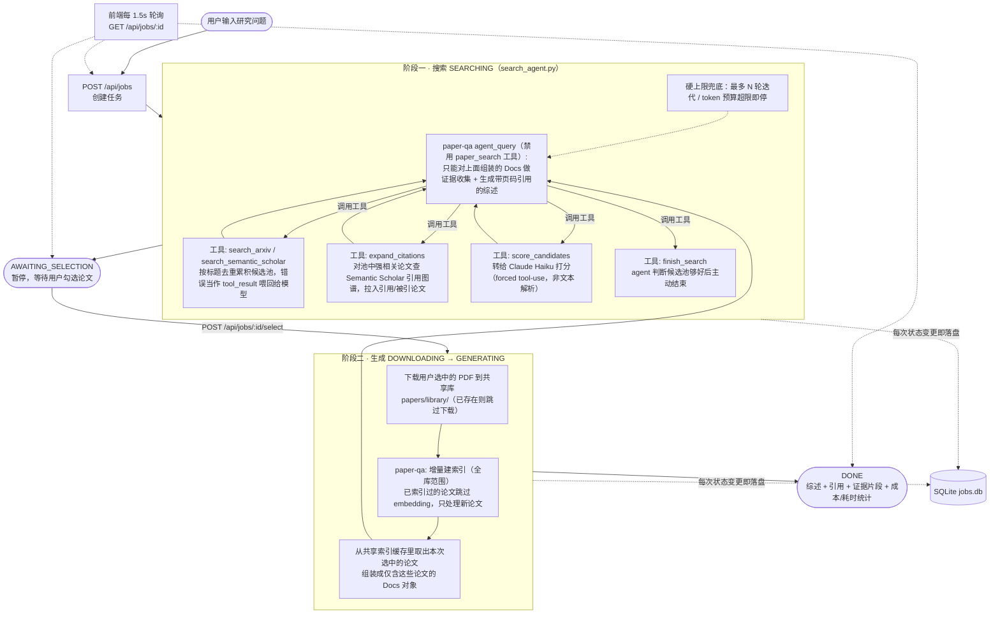

# 论文检索 + 文献综述 Agent

输入一个研究问题 → Agent 自动检索 arXiv / Semantic Scholar → 用 LLM 对候选论文相关性打分排序 → 用户确认后下载全文 → 基于 [PaperQA2](https://github.com/Future-House/paper-qa) 做证据收集，生成带精确引用（页码级）的文献综述。

## 核心特性

- **两阶段流程**：搜索阶段先让用户确认候选论文，再下载生成，避免在无关论文上浪费预算
- **真正的搜索 agent**：Claude Sonnet 通过 tool-use 循环自主决定关键词、搜索源、何时停止，而非固定流水线；打分转给便宜模型 Claude Haiku；每轮决策前写一句中文计划并记入日志，推理过程可见
- **引用图谱 snowballing**：除了关键词检索，agent 可对候选池里的强相关论文调用 Semantic Scholar 的引用图谱（`expand_citations`），把它引用的和引用它的论文也拉进候选池——citation neighbor 通常比换一个关键词猜测更精准命中主题
- **引用证据可追溯**：每条论断可展开查看具体来自哪篇论文的哪一页、原始证据摘录
- **引用幻觉自查**：确定性字符串比对 + LLM-as-judge 两层核查，前端区分"确定性检查"和"LLM判断"，核查失败时会显式提示，不会被静默隐藏
- **Prompt injection 防御**：外部内容（论文摘要、证据片段）统一用分隔符包裹并声明"这是数据不是指令"，另加启发式扫描作为可见信号；10 次真实注入攻击测试均未成功
- **Prompt caching**：搜索 agent 多轮循环复用 system prompt 和历史对话前缀，真实场景实测降低约 40-50% 有效输入成本
- **测试与 eval**：pytest 回归套件覆盖注入防御；合成注入 eval 量化引用核查的 recall/假阳性率，曾借此挖出一个约 70% 失败率的真实可靠性 bug
- **RAG 质量 eval（context precision/recall + answer relevance）**：不只测"引用是否幻觉"，还量化"检索到的证据有多少被真正用上"（context precision，零成本纯计算）和"该被检索到的关键论点有多少真的被检索到"（context recall，人工标注 + LLM judge）；第一次跑（3篇论文，recall 25%）看着像"多论文检索普遍不均衡"，但扩到5个 case 后发现不成立——另外两个3篇论文的 case 都是100%命中，反而缩小到"两篇话题相近但论证角度不同的论文可能互相抢检索名额"这个更具体的问题，同一个 case 复测两次都稳定漏掉同样2个点，不是噪音
- **回归基线对比**：关键指标存成滚动基线，新结果只有明显超出历史噪声范围才报警，能抓住"没崩但悄悄变差了"的漂移
- **可观测性**：每次生成展示实际耗时、Claude API 花费、token 用量
- **健壮性**：外部依赖限流/报错时单独降级，不拖垮整个任务；进程级限流器保证不超 Semantic Scholar 限速；任务历史落盘，重启后自动清理僵死任务
- **跨任务缓存 + 按任务证据隔离**：所有任务共享论文库和 paper-qa 向量索引，同一篇论文被不同任务选中时复用已有 embedding，实测节省约 30% 生成耗时；但检索范围精确限定在本次任务选中的论文上——agent 拿不到 `paper_search` 工具，物理上无法把共享库里其它任务下载过、但本次未选中的论文检索进证据或引用进综述
- **修正 PDF 抽取的连字乱码**：`identified`、`suffer` 这类词——PDF 字体把 fi/ff/fl 等连字嵌成单个字形，抽取文本时断成一个奇怪的 Unicode 字符，破坏了词形——在解析阶段做了针对性修复；特意不用 `unicodedata.normalize("NFKC", ...)`这种一刀切方案，因为它会把 ℝ 变成 R、上标 x² 变成误导性的 x2，对数学密集的论文是负优化
- **真正的"综述"而非单段 QA 回答**：PaperQA2 默认的 `answer_max_sources=5` 是给开放域检索场景调的，在证据池按分数排序后硬截断——选中论文一多，最终生成的引用很容易被 1-2 篇最匹配的论文占满，其余选中论文明明有相关证据却完全没被引用；调大该上限并按选中论文数动态放大 `evidence_k`，同时把 system prompt 和期望篇幅从"简短直接回答"改成"按主题分段、显式比较论文异同、结尾指出分歧或空白"的综述体裁，实测同样3篇论文下引用篇幅从约200词提升到1000+词，且不相关论文仍然不会被强行引用
- **任务队列 + 进度可视化**：FastAPI 后台任务 + 轮询，前端实时展示搜索/选择/下载/生成各阶段状态

## 架构



PaperQA2 内置的搜索工具只检索**本地已索引的目录**，不会自己联网找论文——因此"搜索 arXiv/Semantic Scholar 并下载 PDF"这一段是本项目自己实现的，PaperQA2 只负责拿到本地 PDF 之后的证据收集与生成引用综述（对应 `agent_query`）。

## 技术栈

| 层 | 选型 |
|---|---|
| 后端 | FastAPI + asyncio 后台任务 |
| LLM | Claude Sonnet 5（生成/关键词提炼）、Claude Haiku 4.5（候选论文相关性打分，控制成本） |
| RAG 引擎 | PaperQA2（`paper-qa` 库），证据收集 + 生成走 `agent_query` |
| Embedding | 本地 `sentence-transformers`，不依赖 OpenAI key |
| 论文来源 | arXiv API、Semantic Scholar Graph API |
| 持久化 | SQLite（标准库 `sqlite3`，无 ORM） |
| 前端 | 纯 HTML / CSS / JS，无框架，轮询获取任务状态 |

## 目录结构

- `backend/`
  - `main.py` — FastAPI 路由（`/api/jobs` 系列：POST/GET/DELETE）
  - `config.py` — 环境变量与全局配置（模型名、并发/迭代上限、路径等）
  - `job_manager.py` — 任务状态机（queued → searching → awaiting_selection → downloading → generating → done/failed）
  - `store.py` — SQLite 持久化，Job 状态变更自动落盘，支持删除
  - `pipeline.py` — 两阶段 pipeline：`run_search_stage` / `run_generate_stage`
  - `search_agent.py` — 搜索阶段的 agent：Claude Sonnet tool-use 循环，自主调用 `search_arxiv` / `search_semantic_scholar` / `expand_citations` / `score_candidates` / `finish_search`，打分工具内部转给 Claude Haiku（forced tool-use）
  - `search/`
    - `arxiv_search.py` — arXiv API 检索
    - `semantic_scholar_search.py` — Semantic Scholar Graph API 检索（进程级限流，1 请求/秒）；`get_citation_neighbors` 额外提供引用图谱查询（某篇论文的参考文献 + 施引论文），供 `expand_citations` 工具做 snowballing
    - `merge.py` — 去重
  - `download.py` — 下载 PDF 到共享库，已存在（按 source+id 稳定命名）则跳过
  - `paperqa_engine.py` — 封装 paper-qa 的 `agent_query` 调用：对共享库整体做增量索引复用 embedding 缓存，但只把本次任务选中的论文组装成 `Docs` 传给 agent，并去掉 `paper_search` 工具（改用自定义 `PaperQAEnvironment` 子类跳过 paper-qa 默认的"清空 Docs"行为），确保证据检索精确限定在本次选中范围内，不会漏到共享库里其它任务的论文；同时按选中论文数动态调大 `evidence_k` / `answer_max_sources`，并覆盖 `prompts.system` / `answer.answer_length` 让输出偏向"分主题综述"而非默认的单段 QA 简答；自定义 `parse_pdf` 包一层连字修复，解决 PDF 抽取文本里 fi/ff/fl 等连字断词的问题
  - `verifier.py` — 综述生成后的引用自查：确定性字符串比对 + 便宜模型逐条核对，两层
  - `security.py` — 外部内容（论文摘要/证据片段）的 prompt injection 防御：显式数据/指令分隔包装 + 启发式检测（仅提示不拦截）
  - `models.py` — `PaperCandidate` 数据结构
  - `tests/`
    - `test_prompt_injection.py` — 防御的 pytest 回归套件（真实 API 调用，非 mock）
    - `eval_verifier.py` — 引用自查的合成注入 eval，量化 recall / 假阳性率
    - `test_verifier_deterministic.py` — 确定性检查函数的纯单元测试，不调用 API
    - `fixtures/sample_review.json` — eval 用的真实综述样本
    - `baseline_metrics.py` / `capture_baseline.py` / `check_regression.py` — 把关键指标存成滚动基线，新结果超出历史区间才报警（非零退出码可接 CI）
    - `test_check_regression.py` — 比对逻辑本身的纯单元测试
    - `rag_eval.py` — RAG 质量 eval：`context_precision`（零成本，复用 `sample_review.json` 纯计算）接入上面的滚动基线；`context_recall` / `answer_relevance` 要真跑生成（`fixtures/context_recall_cases.json` 里人工标注的关键论点 + LLM judge），成本量级不同，故意留在滚动基线之外，单独手动跑（`python -m backend.tests.rag_eval`）
- `frontend/`
  - `index.html` / `style.css` / `app.js` — 候选论文勾选、进度轮询、证据展开、历史任务列表
- `papers/library/` — 所有任务共享的 PDF + paper-qa 索引目录（跨任务复用）
- `jobs.db` — 任务历史持久化（本地文件，不入库）

## API

| 方法 | 路径 | 用途 |
|---|---|---|
| POST | `/api/jobs` | 提交研究问题，触发搜索阶段 |
| GET | `/api/jobs` | 历史任务列表（摘要） |
| GET | `/api/jobs/{id}` | 单个任务完整状态（日志/候选论文/结果/证据） |
| POST | `/api/jobs/{id}/select` | 提交勾选的论文 id，触发下载+生成阶段 |
| DELETE | `/api/jobs/{id}` | 删除一条历史记录（仅限已完成/已失败的任务，不影响共享库里的 PDF） |

## 快速开始

复制 `.env.example` 为 `.env` 并填写：

- `ANTHROPIC_API_KEY`（必填）
- `SEMANTIC_SCHOLAR_API_KEY`（可选，不填也能跑，只是限速更低）
- 其余项有默认值，一般不用改

```bash
venv/Scripts/python.exe -m uvicorn backend.main:app --reload --port 8000
```

（必须从项目根目录启动，用 `backend.main:app` 而不是 `cd backend` 后 `main:app`——`backend/main.py` 里用的是相对导入 `from . import config`，从 `backend` 目录内直接启动会报 `ImportError: attempted relative import with no known parent package`。`.claude/launch.json` 里配的就是这个正确方式。）

浏览器打开 http://localhost:8000

## 工程亮点

跑通过程中几个靠实测才暴露、值得一提的坑：

- **上游依赖不兼容**：paper-qa 调用 `LiteLLMModel.get_router()`，但它依赖的 `fhlmi` 库新版本已删除该方法（两个包的 PyPI 最新版互不兼容）；二分定位到最后一个兼容版本并锁定依赖
- **模型参数兼容性**：Claude Sonnet 5 拒绝 `temperature` 参数，但 paper-qa 默认总会带上；`litellm.drop_params` 对新模型不生效，改为手动构造不含该字段的 `llm_config`
- **强制结构化输出≠符合 schema**：`tool_choice` 强制工具调用后，模型偶尔把数组字段返回成看起来像数组、实际截断了的字符串——因为仍是合法 JSON，SDK 不报错；加了显式类型校验（`list`/`dict`）而不只是"能否 parse"
- **Eval 逼出真实故障率**：给引用校验做合成注入 eval 时，反复运行意外发现证据池较大（15条）时结构化输出失败率高达 70%；定位到是"prompt 里塞的证据原文量"而非输出复杂度导致，改为只给完整原文给真正引用到的证据、其余只给标识列表，失败率回落到约 20% 的背景水平
- **跨任务缓存复用**：没有重新发明缓存逻辑，而是读 paper-qa 源码发现它自带按文件路径去重的增量索引——只要多个任务共享同一个论文目录，缓存复用就是免费的；实测冷/热启动对比省约 30% 生成耗时
- **共享索引 = 隐性的跨任务证据污染**：读 paper-qa 源码才发现，`agent_query` 默认的 `paper_search` 工具会对*整个*共享目录索引做全文检索，检索到的论文会被直接塞进本次任务的证据池——跟本次任务选没选中这篇论文完全无关，也就是说其它任务下载过的论文只要文本匹配度高，可能被真的引用进这次生成的综述正文，不只是"证据面板里能看到"这么温和。修法是去掉 `paper_search` 工具，改成自己从共享索引缓存里按选中论文的文件名精确取出已算好的 embedding 组装 `Docs`——既堵住了污染，又没放弃跨任务缓存
- **调用约定里藏着一个"清空"的隐藏副作用**：以为把组装好的 `Docs` 传给 `agent_query(docs=...)` 就万事俱备，结果每次运行开头证据池都是空的——追进源码发现 `PaperQAEnvironment._reset_docs()` 默认会无条件清空传入的 `Docs`，因为它假设你依赖 `paper_search` 在本轮重新填充；去掉 `paper_search` 之后这个假设不成立，得继承 `PaperQAEnvironment` 并重写这个 hook 为空操作才能让预置的证据留住
- **默认参数是给别的场景调的，不是给这个场景调的**：`answer_max_sources`（默认5）和 `evidence_k`（默认10）是在证据池按分数排序后做硬截断，且这个截断只发生在拼给生成模型的最终 prompt 里——`session.contexts`（前端证据面板读的）不受影响，所以问题很隐蔽：证据面板看着挺全，生成的综述却可能只引用了1-2篇最匹配的论文，其余选中论文的证据其实早被截断在生成 prompt 之外，界面上完全看不出来
- **Prompt caching 断点管理**：Anthropic 单次请求最多 4 个 `cache_control` 断点，若每轮新增不清理会线性超限；改为维护一个动态断点、每轮后移，真实搜索场景里换算约省 40-50% 有效输入成本
- **对抗测试量化了防御差异**：10 次真实注入攻击调用中均未成功突破，但加了防御后模型会稳定在回复中明确说明"识别到注入并已忽略"，这是一个可审计信号；把一次性测试打包成 pytest 回归套件后第一次跑就挖出启发式扫描器的多个真实漏检（尤其是中文场景）
- **第三方 ID 格式不能想当然**：Semantic Scholar 的 `ARXIV:` 外部 ID 查询不接受 arXiv 自己 ID 里的版本号后缀（`2511.13780v1` 查引用图谱会 404，`2511.13780` 才 200）——本地跑通 `expand_citations` 才发现，不去掉版本号这个功能实测下来会对所有真实候选静默失败
- **"标准修复"对这个领域是负优化**：修连字乱码最直接的想法是 `unicodedata.normalize("NFKC", ...)`，一行代码、零依赖；但实测发现它会把 ℝ（双竖线粗体 R，数学里代表实数集）直接变成普通字母 `R`，把上标 `x²` 拍平成 `x2`（意思从"x的平方"变成"x乘以2"，是错误改写不是无害改写），把斜体/粗体数学字母也拍成普通字母——对科学论文这种数学符号语义敏感的文本，全量 NFKC 是引入新 bug 而不是修 bug；改成只翻译 U+FB00-FB06 这几个明确的连字字符，不碰其它兼容字符
- **回归基线而非固定阈值**：固定阈值测试抓不住"没跌破阈值但在变差"的漂移，加了 `capture_baseline.py`/`check_regression.py` 把关键指标存成滚动区间，超出历史噪声范围才报警

## 已知局限

- 单机内存态并发控制，未做分布式部署适配
- 没有鉴权，仅适合本地单用户使用
- Prompt injection 的启发式检测只是关键词正则，不是可靠防线——真正的防御是数据/指令分隔包装，检测仅作为可见信号
